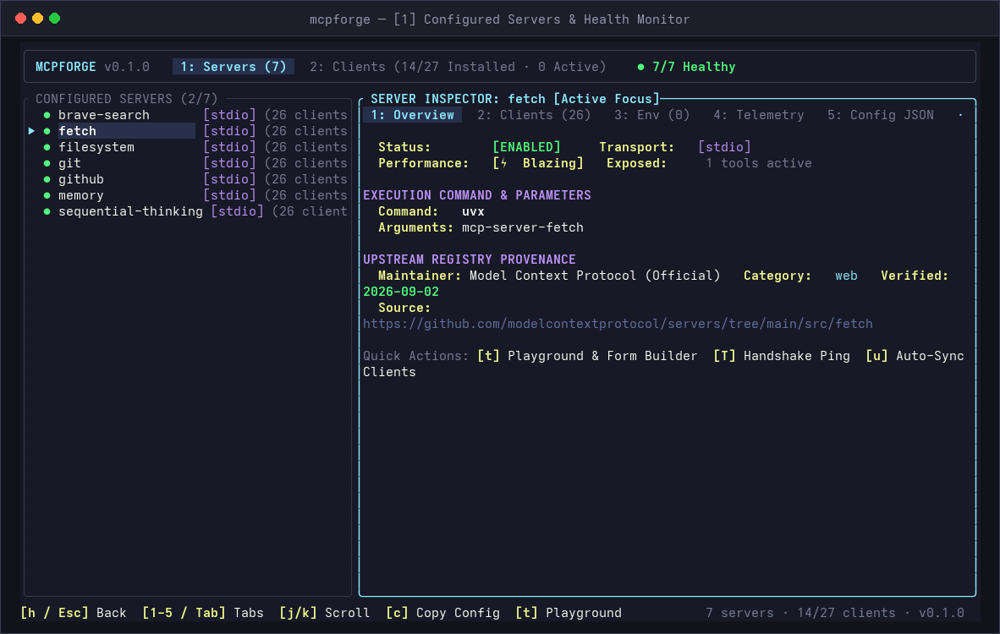
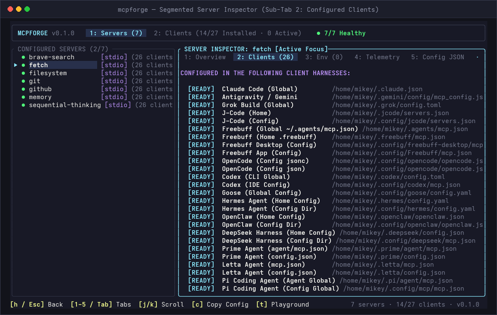
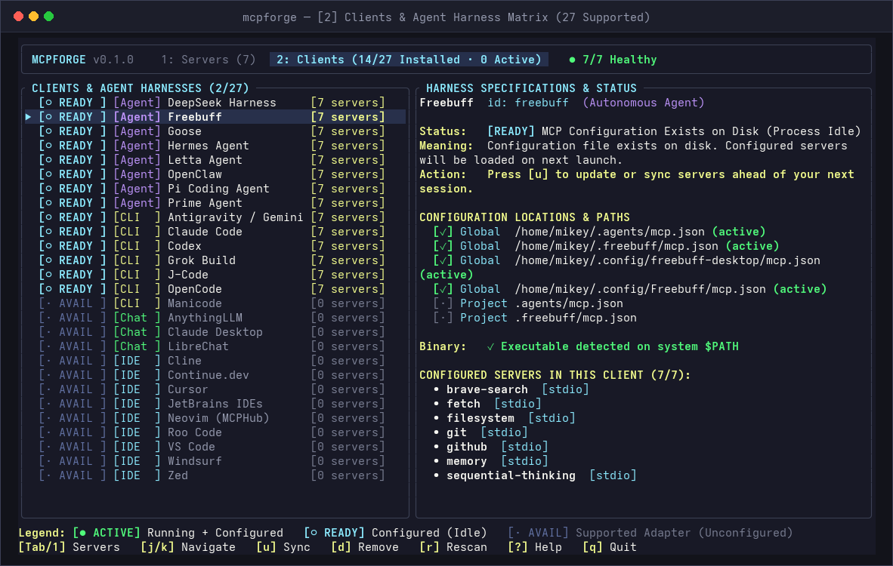
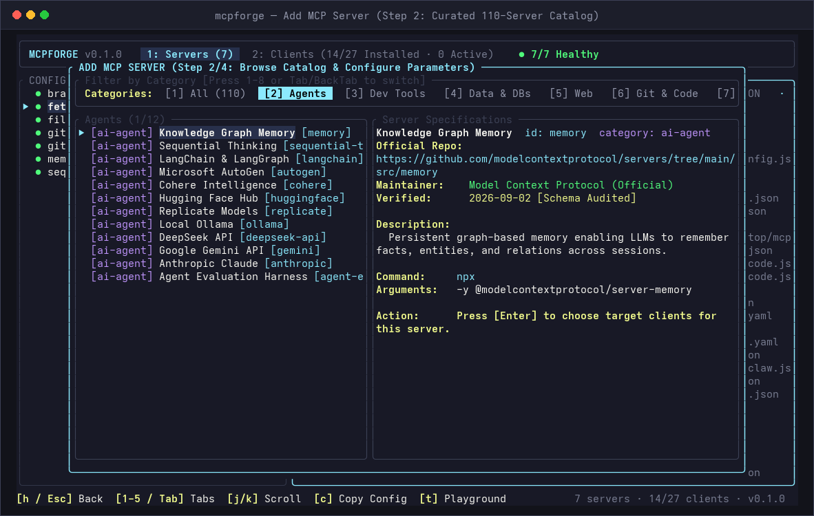
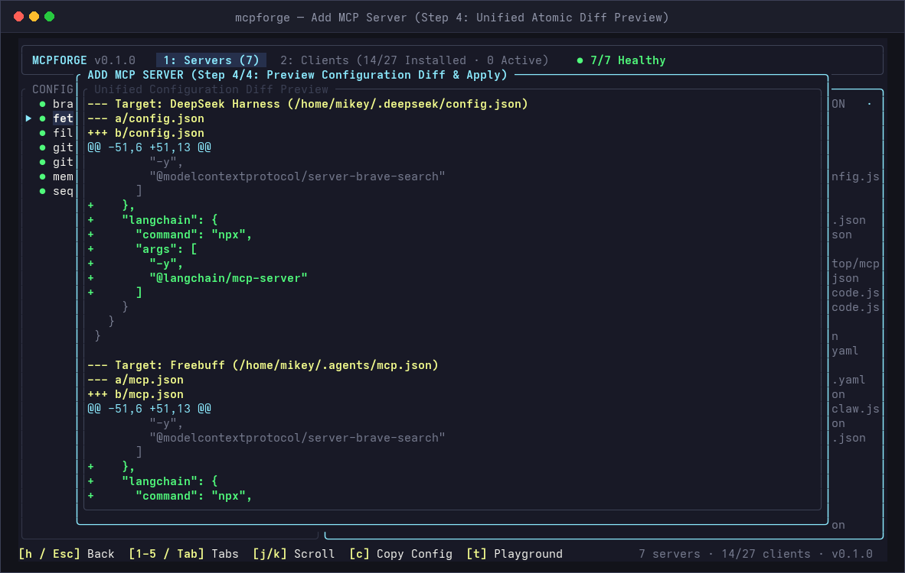
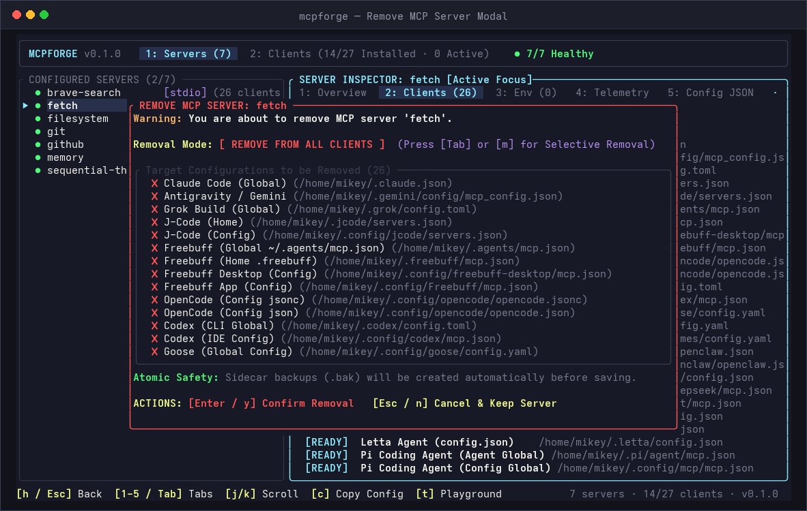
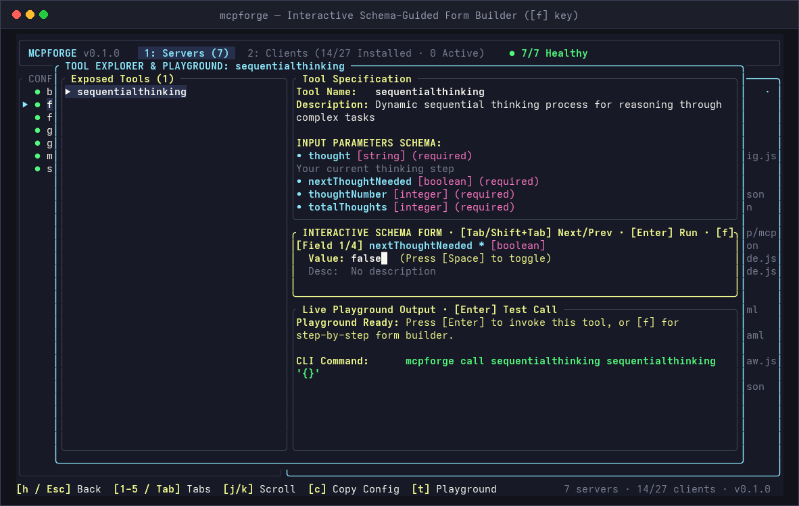
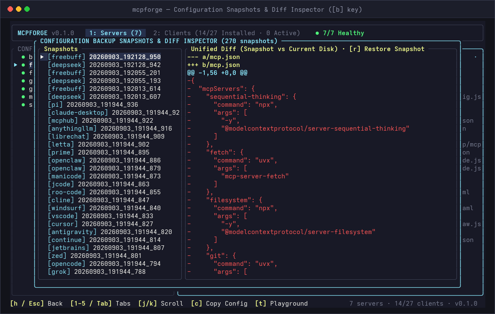

<h1 align="center">MCPForge</h1>

<p align="center">
  <strong>The TUI that discovers every MCP client on your machine and syncs them all.</strong><br>
  <em>One native binary. 27 client adapters. 110 audited servers. Zero config fragmentation.</em>
</p>

<p align="center">
  
  
  
  
  
  
</p>

<p align="center">
  <a href="#overview">Overview</a> •
  <a href="#why-mcpforge">Why MCPForge?</a> •
  <a href="#screenshots">Screenshots</a> •
  <a href="#supported-clients">Supported Clients</a> •
  <a href="#installation">Installation</a> •
  <a href="#usage">Usage</a> •
  <a href="#architecture">Architecture</a> •
  <a href="#license">License</a>
</p>

<p align="center">
  
</p>

---

## Overview

As the Model Context Protocol ecosystem has grown, every AI client, autonomous agent harness, and code editor has introduced its own configuration format and path. Your tools end up fragmented across:

- `~/.agents/mcp.json` (Freebuff Desktop & CLI)
- `~/.claude.json` (Claude Code)
- `~/.deepseek/config.json` (DeepSeek Harness)
- `~/.config/goose/config.yaml` (Goose - YAML)
- `~/.hermes/config.yaml` (Hermes Agent - YAML)
- `~/.codex/config.toml` (Codex - TOML)
- `~/.grok/config.toml` (Grok Build - TOML)
- `~/.config/opencode/opencode.jsonc` (OpenCode - JSONC)
- `~/.pi/agent/mcp.json` (Pi Coding Agent)
- Plus VS Code, Cursor, Windsurf, Zed, JetBrains, Continue.dev, Cline, and 14 others.

**MCPForge** eliminates this fragmentation. Built in Rust with a fast, zero-flicker [Ratatui](https://ratatui.rs) terminal UI, MCPForge gives you an interactive command center to inspect live client processes, provision audited MCP servers, verify schema drift, and sync configurations across all 27 clients simultaneously.

---

## Why MCPForge?

| Capability | **MCPForge** | **mcpm** (mcpm.sh) | **mcpman** | **Microsoft APM** | **mcps** |
| :--- | :---: | :---: | :---: | :---: | :---: |
| **Interface** | **Interactive TUI + Scriptable CLI** | Pure CLI | Pure CLI | Pure CLI | Pure CLI |
| **Runtime** | **Single native binary (Rust, zero Node.js)** | Node.js / npm | Node.js / npm | Python 3 | Node.js / npm |
| **Supported Clients** | **27 Clients (JSON, JSONC, YAML, TOML)** | 2 Clients | 3 Clients | 1 Client | 2 Clients |
| **Client Process Discovery** | **Live OS process watcher + scanner** | None (manual) | None | None | None |
| **Format Preservation** | **Non-destructive AST round-tripping** | Clobbers root keys | Overwrites config | Specific format only | Drops unmanaged keys |
| **Comment Resilience** | **Zero-loss JSONC comment tolerance** | Crashes / strips | Strips comments | N/A | Strips comments |
| **Diff Preview** | **Unified color diff before disk write** | None | None | None | None |
| **Configuration Rollback** | **Instant 1-command snapshot restore** | None | None | None | None |
| **Targeted Testing** | **Live handshake sandbox (`mcpforge test`)** | None | None | None | None |
| **Schema Drift Audit** | **`mcpforge verify` built-in** | None | None | None | None |
| **Catalog Provenance** | **110 audited servers with upstream audit dates** | Unverified list | Unverified list | Microsoft-only subset | Unverified registry |
| **Self-Healing Doctor** | **Sub-millisecond ping + safe auto-fix** | None | Basic ping | None | None |

---

## Key Features

- **Keyboard-Driven Terminal UI**: High-speed, zero-flicker TUI with instant filtering, intuitive split views, and vim/arrow navigation.
- **27 First-Class Client Adapters**: Native read and write support for autonomous agents, terminal CLIs, full IDEs, and chat desktop clients across JSON, JSONC, YAML, and TOML.
- **Interactive Schema-Guided Form Builder (`[f]` key)**: Synthesizes input form fields directly from tool JSON schemas with boolean toggles and type validation.
- **Fullscreen Tool Output Inspector & Clipboard Exporter (`[v]` / `[c]`)**: Fullscreen scrollable pager with line numbering and native OSC 52 clipboard export.
- **Visual In-TUI Backup Snapshots & Diff Inspector (`[b]` key)**: Browse automatic backup snapshots, view colorized unified diffs against current disk files, and restore in 1 click (`[r]`).
- **First-Class Raspberry Pi Support**: Official pre-compiled releases for ARM64 (Raspberry Pi 4 & 5) and ARMv7 (Raspberry Pi 2 & 3).
- **110+ Audited MCP Servers with Provenance**: Curated, production-tested MCP servers with upstream source URLs, maintainer attribution, and verification audit timestamps.
- **Automated Schema Drift Verification**: Built-in schema validator (`mcpforge verify`) detects syntax corruption, missing properties, or format shifts across all 27 clients in local environments and CI pipelines.
- **Golden-Tested Format Preservation**: Rigorous golden-file round-trip tests and key-preservation property tests guarantee that modifying servers never drops unmanaged configuration keys, comments, or settings.
- **Comment-Tolerant JSON Parsing**: Comment-resilient parser gracefully reads configs containing `//` or `/* */` comments and trailing commas without configuration loss.
- **Automated Rollback & Backup Engine**: Every edit automatically creates timestamped backup snapshots. Roll back any client instantaneously with `mcpforge rollback [--client <id>]` or inspect differences with `mcpforge backup diff`.
- **Targeted Diagnostic Engine (`mcpforge test`)**: Interactively test single servers or raw executable commands with live JSON-RPC handshakes, tool counts, and latency measurements without altering configurations.
- **Segmented Inspector & Canonical Snippets**: Press `Enter` or `l` on any server to focus the inspector pane with sub-tabs for Overview, Client Associations, Environment Variables, Telemetry, and syntax-highlighted JSON snippets with 1-click clipboard export (`c`).
- **Adapter-Accurate Diff Previews**: Every configuration modification is simulated using the target client's actual format engine before touching disk, guaranteeing that existing configurations are never overwritten or corrupted.
- **Live Telemetry & Diagnostics**: Background ping engine queries stdio subprocesses and HTTP/SSE endpoints with sub-millisecond precision, reporting latency, active tool counts, and server versions.
- **Interactive Server Removal**: Safely purge servers across all clients at once or interactively pick and choose targets.
- **Portable Profiles & Packs**: Export your entire multi-tool MCP environment into reproducible portable JSON files and import them on new machines with automated secret resolution.

---

## Screenshots

### 1. Unified Dashboard & Two-Pane Command Center
Navigate configured servers with instant search filtering (`/`), two-pane focus navigation (`Enter` / `Esc`), and live sub-millisecond runtime health telemetry.

<p align="center">
  
</p>

---

### 1b. Segmented Server Inspector (Sub-Tabs & Scrolling)
Drill into server configurations without vertical clutter. Seamlessly cycle across Overview, Clients, Environment Variables, Telemetry, and Canonical JSON with number keys `1`–`5`, `[` / `]`, or `Tab`, with independent `j/k` scrolling.

<p align="center">
  
</p>

---

### 2. Supported Clients & Agent Harness Matrix
View all 27 supported AI harnesses, categorized by lifecycle state (`ACTIVE`, `RUNNING`, `READY`, `AVAILABLE`), with binary detection, disk paths, and configured servers.

<p align="center">
  
</p>

---

### 3. Curated 110-Server Catalog with Environment Checks
Filter pre-tested MCP servers by category (`Agents`, `Dev Tools`, `Data & DBs`, `Web`, `Git`, `Cloud`, `Productivity`) with real-time environment variable validation.

<p align="center">
  
</p>

---

### 4. Adapter-Accurate Unified Diff Preview
Preview the exact unified diff generated for each client adapter before applying, guaranteeing zero accidental deletions or syntax corruption.

<p align="center">
  
</p>

---

### 5. Interactive Removal Modal
Safely decommission servers from all clients at once, or use the interactive checklist to remove from specific clients with automatic `.bak` backups.

<p align="center">
  
</p>

---

### 6. Interactive Schema-Guided Form Builder (`[f]` Key)
Invoke any tool without handwriting JSON. The form builder auto-synthesizes input forms directly from JSON schemas with real-time field validation, boolean toggles, and enum selectors.

<p align="center">
  
</p>

---

### 7. Configuration Snapshots & Diff Inspector (`[b]` Key)
Inspect automatic backup snapshots taken before every mutation. View colorized unified diffs against live disk configs, and instantly restore previous versions with 1 click (`[r]`).

<p align="center">
  
</p>

---

## Supported Clients

MCPForge provides native, format-preserving adapters for **27 distinct AI clients and harnesses**:

| Category | Client / Harness | Config Path | Format | Status |
| :--- | :--- | :--- | :--- | :--- |
| **Agent** | **Freebuff Desktop & CLI** | `~/.agents/mcp.json` | JSON | Supported |
| **Agent** | **Pi Coding Agent** | `~/.pi/agent/mcp.json` | JSON | Supported |
| **Agent** | **DeepSeek Harness** | `~/.deepseek/config.json` | JSON | Supported |
| **Agent** | **Goose** | `~/.config/goose/config.yaml` | YAML | Supported |
| **Agent** | **Hermes Agent** | `~/.hermes/config.yaml` | YAML | Supported |
| **Agent** | **OpenClaw** | `~/.openclaw/openclaw.json` | JSON | Supported |
| **Agent** | **Prime Agent** | `~/.prime/agent/mcp.json` | JSON | Supported |
| **Agent** | **Letta Agent** | `~/.letta/mcp.json` | JSON | Supported |
| **CLI** | **Claude Code** | `~/.claude.json` | JSON | Supported |
| **CLI** | **Codex** | `~/.codex/config.toml` | TOML | Supported |
| **CLI** | **Grok Build** | `~/.grok/config.toml` | TOML | Supported |
| **CLI** | **OpenCode** | `~/.config/opencode/opencode.jsonc` | JSONC | Supported |
| **CLI** | **Antigravity / Gemini** | `~/.gemini/config/mcp_config.json` | JSON | Supported |
| **CLI** | **J-Code** | `~/.jcode/servers.json` | JSON | Supported |
| **CLI** | **Manicode** | `~/.config/manicode/mcp.json` | JSON | Supported |
| **IDE** | **Cursor** | `~/.cursor/mcp.json` | JSON | Supported |
| **IDE** | **VS Code** | `~/.vscode/mcp.json` | JSON | Supported |
| **IDE** | **Windsurf** | `~/.codeium/windsurf/mcp_config.json` | JSON | Supported |
| **IDE** | **Zed** | `~/.config/zed/settings.json` | JSON | Supported |
| **IDE** | **JetBrains IDEs** | `~/.config/JetBrains/mcp.json` | JSON | Supported |
| **IDE** | **Neovim (MCPHub)** | `~/.config/mcphub/servers.json` | JSON | Supported |
| **IDE** | **Cline** | `~/.config/Code/.../cline_mcp_settings.json` | JSON | Supported |
| **IDE** | **Roo Code** | `~/.config/Code/.../cline_mcp_settings.json` | JSON | Supported |
| **IDE** | **Continue.dev** | `~/.continue/config.json` | JSON | Supported |
| **Chat** | **Claude Desktop** | `~/.config/Claude/claude_desktop_config.json` | JSON | Supported |
| **Chat** | **LibreChat** | `~/.librechat/librechat.yaml` | YAML | Supported |
| **Chat** | **AnythingLLM** | `~/.config/anythingllm-desktop/...` | JSON | Supported |

---

## Installation

### Pre-compiled Binaries (Recommended)

Pre-built binaries for Linux (`x86_64`), Raspberry Pi (`ARM64` & `ARMv7`), macOS (`Apple Silicon & Intel`), and Windows (`x64`) are available on the [GitHub Releases page](https://github.com/nordicnode/mcpforge/releases).

```bash
# Linux (x86_64)
curl -fsSL https://github.com/nordicnode/mcpforge/releases/latest/download/mcpforge-x86_64-unknown-linux-gnu.tar.gz | tar -xz
sudo mv mcpforge /usr/local/bin/

# Raspberry Pi (64-bit Pi 4 & Pi 5 - ARM64)
curl -fsSL https://github.com/nordicnode/mcpforge/releases/latest/download/mcpforge-aarch64-unknown-linux-gnu.tar.gz | tar -xz
sudo mv mcpforge /usr/local/bin/

# Raspberry Pi (32-bit Pi 2 & Pi 3 - ARMv7)
curl -fsSL https://github.com/nordicnode/mcpforge/releases/latest/download/mcpforge-armv7-unknown-linux-gnueabihf.tar.gz | tar -xz
sudo mv mcpforge /usr/local/bin/
```

### Package Managers

#### cargo-binstall (Instant pre-compiled binary install)
```bash
cargo binstall mcpforge
```

#### Homebrew (macOS & Linux)
```bash
brew tap nordicnode/tap https://github.com/nordicnode/mcpforge
brew install mcpforge
```

#### Arch Linux & CachyOS (AUR)
```bash
paru -S mcpforge-bin
# or
yay -S mcpforge-bin
```

### Build from Source

Ensure you have Rust 1.80+ and `cargo` installed:

```bash
git clone https://github.com/nordicnode/mcpforge.git
cd mcpforge
cargo build --release
sudo cp target/release/mcpforge /usr/local/bin/
```

### Cargo Install

```bash
cargo install mcpforge
# or from git:
cargo install --git https://github.com/nordicnode/mcpforge.git
```

---

## Usage

### Interactive TUI

Launch the full interactive command center:

```bash
mcpforge
```

#### Keybindings

| Key | Context | Action |
| :--- | :--- | :--- |
| `Tab` / `1` / `2` | Global | Switch between `[1] Servers` and `[2] Clients` views |
| `j` / `k` or `Down` / `Up` | Navigation | Move cursor through server or client lists |
| `Space` | Servers View | Toggle server enabled / disabled |
| `v` / `Enter` | Dashboard | View canonical configuration snippet modal |
| `a` | Global | Open Add Server Wizard (4-step provisioning) |
| `d` / `Delete` / `x` | Global | Open Interactive Server Removal Modal |
| `u` | Global | Sync all servers across all detected clients |
| `r` | Global | Run instant diagnostic health checks & ping latencies |
| `/` | Dashboard | Fuzzy search configured servers and tags |
| `?` | Global | Open full interactive keyboard guide |
| `q` / `Esc` | Global | Quit application |

---

### Command Line Interface

MCPForge provides a scriptable CLI for automation, CI/CD pipelines, and dotfile management:

```bash
# Discover all installed AI harnesses and client configuration files
mcpforge discover

# Audit all detected client configuration files for syntax errors and schema drift
mcpforge verify

# Audit a specific client adapter only
mcpforge verify --client codex

# Test a configured server with live JSON-RPC handshake and latency report
mcpforge test fetch

# Test an arbitrary command before adding it to any client
mcpforge test --command uvx --args mcp-server-fetch

# Auto-synchronize all configured servers across every detected client
mcpforge sync --auto

# List all configured MCP servers and client associations
mcpforge list

# Run diagnostic health checks and measure latency for all servers
mcpforge doctor

# Auto-heal broken configurations and resolve missing environment variables
mcpforge doctor --fix

# Roll back a client configuration to its previous snapshot
mcpforge rollback --client freebuff

# List all configuration backup snapshots
mcpforge backup list

# View diff between current client config and its latest backup
mcpforge backup diff freebuff

# Add a server from the curated catalog to all installed clients
mcpforge setup postgres

# Add a server to specific clients only
mcpforge setup github --to freebuff,deepseek,claude-code

# Remove a server across all clients
mcpforge remove brave-search --all

# Export multi-client setup to a portable JSON file (with secrets redacted)
mcpforge export --output my-team-mcp.json

# Import and provision servers onto a new system
mcpforge import --input my-team-mcp.json
```

---

## Architecture

MCPForge is built as a modular Cargo workspace designed for speed, safety, and extensibility:

```
mcpforge/
├── crates/
│   ├── mcp-core/              # MCP protocol primitives, JSON-RPC 2.0, Transports (Stdio, HTTP, SSE)
│   ├── mcpforge-adapters/     # 26 client adapters, format AST engines, schema verifier, golden tests
│   │   └── tests/fixtures/    # 26 golden config fixtures (JSON, JSONC, YAML, TOML)
│   ├── mcpforge-registry/     # Embedded registry with 110+ audited server entries & provenance
│   └── mcpforge/              # Ratatui TUI application, modular CLI dispatch, process watcher
│       ├── src/cli/           # Modular CLI dispatch & handlers (verify, sync, doctor, pack, add, etc.)
│       ├── src/tui.rs         # Terminal lifecycle, raw mode, and keyboard event loop
│       └── src/main.rs        # Clean, lightweight 15-line entry point
├── catalog/
│   └── default_registry.json  # 110 audited server definitions with upstream source URLs & maintainers
├── assets/
│   └── screenshots/           # High-resolution retina terminal captures
└── scripts/
    └── render_screenshots.py  # Headless PIL screenshot generation engine
```

---

## Contributing

Contributions, bug reports, and new client adapter submissions are welcome!

1. Fork the repository
2. Create your feature branch (`git checkout -b feature/my-new-adapter`)
3. Commit your changes (`git commit -m 'feat(adapter): add support for MyClient'`)
4. Verify tests, schema drift, and linting:
   ```bash
   cargo fmt --all -- --check
   cargo clippy --workspace --all-targets --all-features -- -D warnings
   cargo test --workspace --all-features
   cargo run -- verify
   ```
5. Push to your branch and open a Pull Request

---

## License

Distributed under the MIT License. See `LICENSE` for details.
